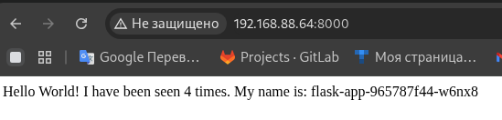

# Лабораторная работа №9  

## Выполнена в рамках прохождения обучения по курсу DevOps СИТУ  

Результаты запуска подов и сервисов  
  

Результаты запуска сервисов приложения в браузере   
  

И обновление версии приложения  

